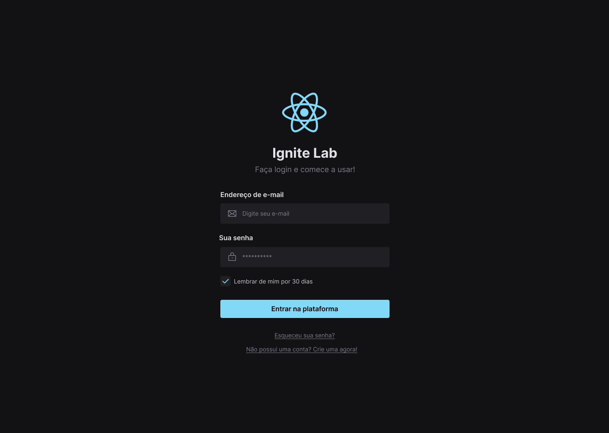

# Ignite Lab Design System

Aplicação desenvolvida para construir um design do Figma ao Front-end com testes pelo Storybook e ferramentas de componentes avançada.

<p align="center">
  
</p>

## Layout

O protótipo da aplicação pode ser encontrado em:

- [Layout Web](https://www.figma.com/file/MmZoT9snn5LpH80rMCnalI/Ignite-Lab-Design-System)

## Instalação

Clone o repositório pelo terminal:

```bash
git clone https://github.com/mthonorio/IgniteLab-Design-System.git
```

No diretório raiz do projeto, baixe todas as dependências:

```
npm install
```

Para executar o projeto:

```
npm run dev
```

## Storybook

O Storybook é um workshop de front-end para criar componentes de interface do usuário e páginas isoladamente. Milhares de equipes o usam para desenvolvimento, teste e documentação de interface do usuário. Saiba mais em https://storybook.js.org.

Para executar o storybook e visualizar os componentes:

```
npm run storybook
```

Para executar os testes de componentes configurados no storybook:

```
npm run test-storybook
```

---

Projeto desenvolvido durante o Ignite Lab Design System da Rocketseat.
